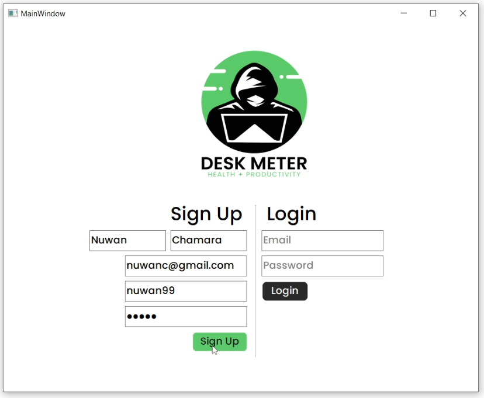
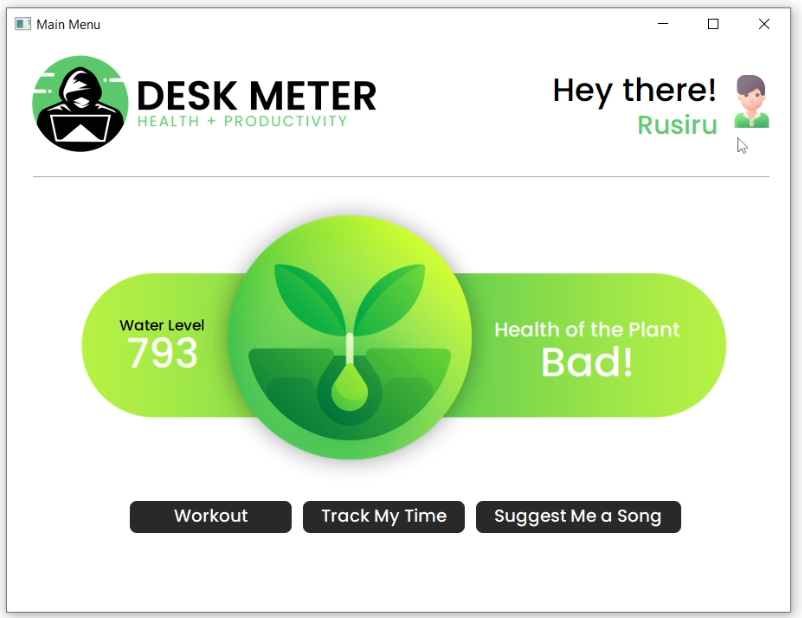
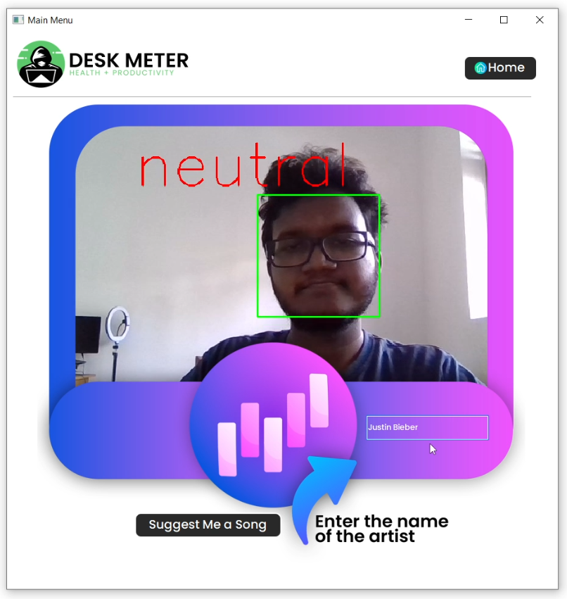
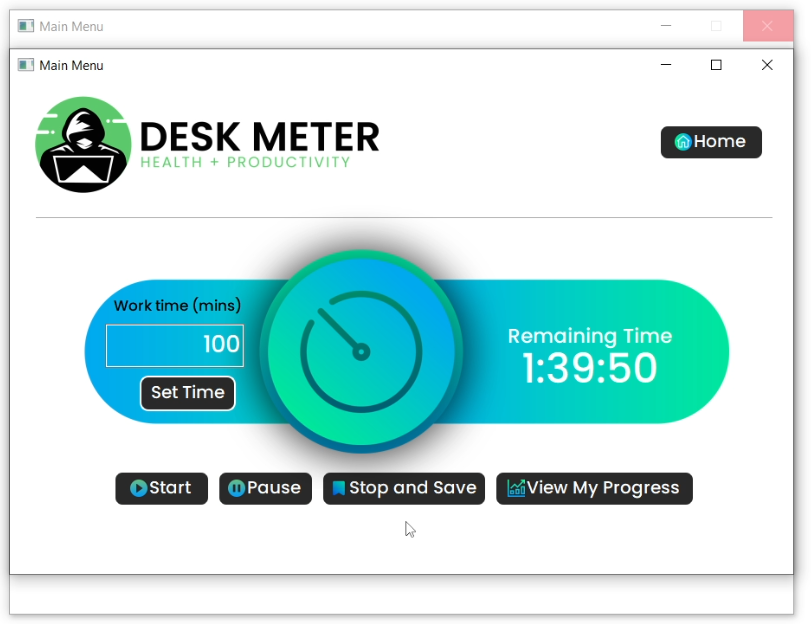
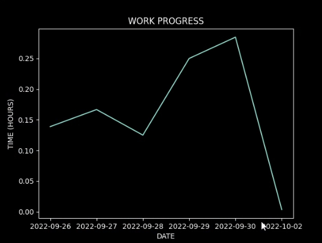
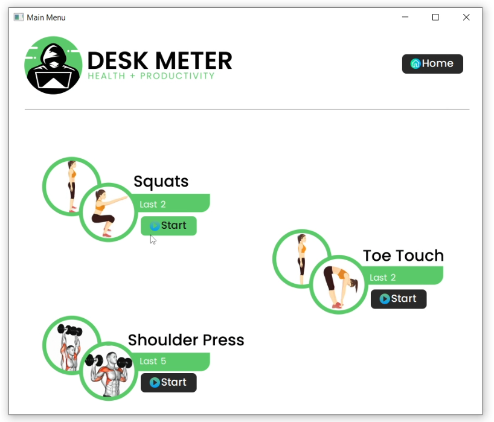
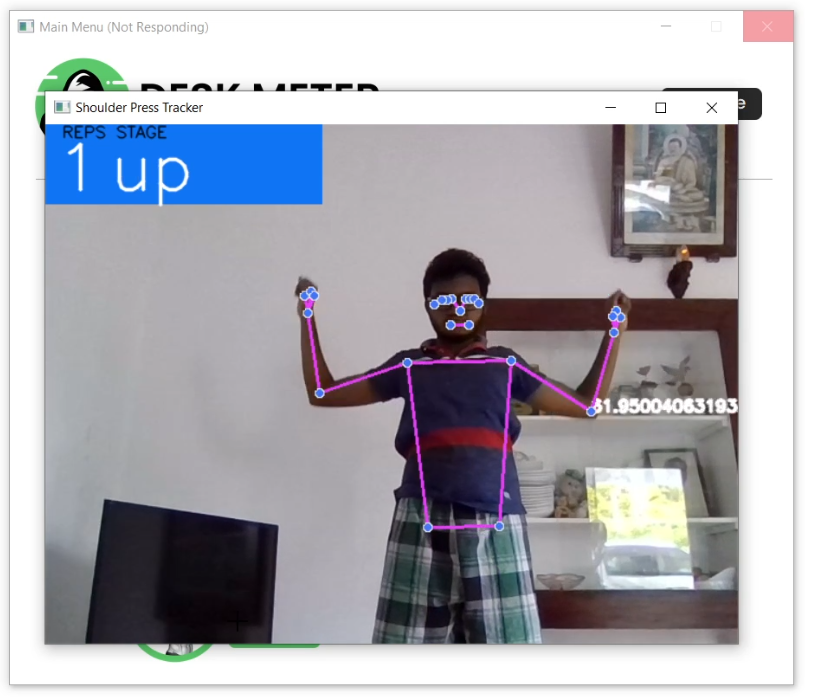

<h1 align="center">
   
  
   
  DeskMeter
   
</h1>

<h4 align="center">A Desktop Application for Software Engineers</h4>

  
  
  
  
  
  
  
  
   
  <a href="#description">Description</a> •
  <a href="#objectives">Objectives</a> •
  <a href="#tools-and-languages">Tools and Languages</a> •
  <a href="#components">Components</a>

## Description
Software engineers spend most of their time sitting on a chair
staring at a screen. This causes many physical and mental health issues.
Being less physically active, dehydration, bad posture and stress are common
between them. DeskMeter is a desktop application that helps the user to
overcome these issues to some extent.

## Objectives

- To help the user to keep track of the work time and rest time
- To provide the user with various physical activities to keep the physical health at a good level
- To promote the mental health of the user by suggesting songs based on the facial emotional features.
- To promote a pleasant working environment by helping the user to take care of a plant in the workplace by monitoring it.

## Tools and Languages
- Languages
  - Python Programming Language
  - Arduino (C) for programming the Arduino Uno Rev3

- Software
  - Applications
    - PyCharm - IDE used for Python programming.
    - AdobeXD - UI/UX designing tool used in prototyping stage.
    - Arduino IDE - Application to write and upload programs to Arduino compatible boards
    - Google Colab - Run Python based codes in a system that meets data science work requirements.
    - Adobe Audition - Audio editing software. Libraries and Frameworks
    - pyFirmata - Python interface for Firmata protocol. Communicates with the Arduino development board.
    - OpenCV - A library for real time computer vision functions.
    - MediaPipe - Media processing framework.
    - Deepface - a lightweight face recognition and facial attribute analysis (age, gender, emotion and race) framework for python.

  - Hardware
    - Arduino Uno Rev3 - Arduino development board
    - Soil Moisture Sensor Module - Measures the amount of soil moisture 

## Components
- Login

 
The user can login or sign up for this application. All the data is stored in Firebase
realtime database. Data validation techniques are used to make sure that the data the
user is entering is valid.

- Main Menu and Plant Monitoring

 
In the main menu, the user can see his name at the top. The user has to connect the
Arduino system to the computer to get the data about the soil moisture level of the plant.
The soil moisture sensor is connected to the plant. The application shows whether the
current soil moisture level of the plant is good or bad for the plant. Other than that the
user can navigate to different functions using the given buttons.

- Song Suggestion

 
The system identifies the facial expressions of the user and when the name of the artist
is entered, the system suggests a song from YouTube for the user.

- Time Tracker

 
The user can use the time tracker option to track his time. First the user has to input
the amount of time that he/she is going to work and press start. Then when start is
pressed the time tracking begins. It can be paused or stopped. The application shows
notifications to drink water, to look away from the screen and to have a break throughout
the working time so the user can know when to do those. The user can see the time that
he/she worked using the “View My Progress” button.
 

- Workout Tracker

 
The user can use the application to track the workouts. There are three workouts
including squats, toe touch and shoulder press. These workouts are mainly focused on
stretching the body as software engineers are sitting all day.
The application tracks the user in real time to count the number of times that the user
did the workouts. This is done by using computer vision and pose estimations.

The user can see the last count of the times that he/she did the workout and gain
motivation to do more. The reps are counted by calculating the angles at relevant joints.

## 🔗 Links

